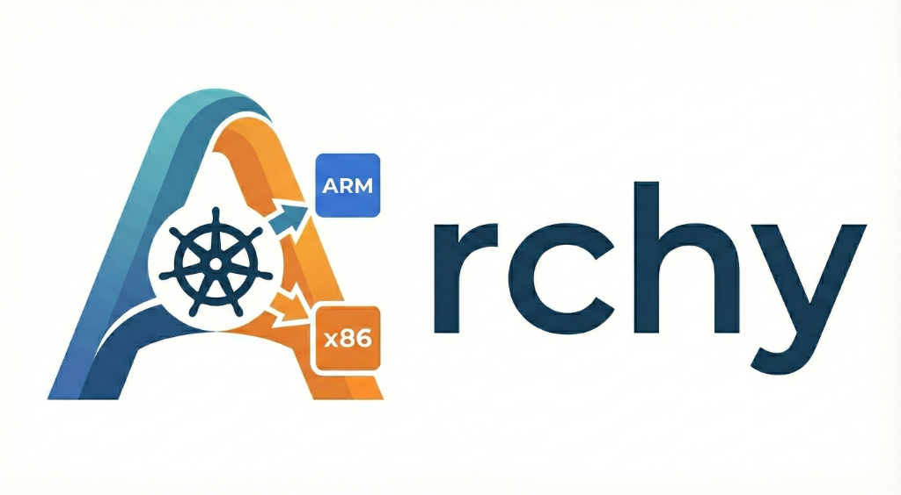

# Archy



Archy is a Kubernetes mutating admission webhook that automatically ensures your Pods are scheduled on nodes with compatible architectures.

## Overview

In multi-architecture Kubernetes clusters (e.g., mixing `amd64` and `arm64` nodes), scheduling pods can be challenging. If a pod is scheduled on a node that doesn't support its container image's architecture, it will fail to start with `CrashLoopBackOff` or `ImagePullBackOff`.

Archy solves this by:
1. Intercepting Pod creation requests.
2. Inspecting the container images defined in the Pod (both init and regular containers).
3. Determining the common supported architectures across all images.
4. Automatically patching the Pod's `nodeSelector` to target the correct architecture.

## Features

- **Automatic Architecture Detection**: Inspects container image manifests to find supported platforms.
- **Multi-Arch Support**: If images support multiple architectures (e.g., multi-arch builds), Archy lets Kubernetes scheduling logic take over, allowing the pod to run on any compatible node.
- **Private Registry Support**: Supports authenticating with private registries using the Pod's `imagePullSecrets` and ServiceAccount credentials.
- **Safety First**: If images have no common architecture, the Pod is rejected to prevent scheduling failures.

## How It Works

When a Pod is submitted to the cluster:
1. Archy receives the `AdmissionReview` request.
2. It extracts the list of images from `spec.containers` and `spec.initContainers`.
3. It queries the container registry (public or private) for each image's manifest.
4. It calculates the intersection of supported architectures.
   - **Single Match**: Adds `kubernetes.io/arch: <arch>` to `spec.nodeSelector`.
   - **Multiple Matches**: No action taken; allows Kubernetes to schedule on any compatible node.
   - **No Match**: Rejects the Pod creation.

## Limitations

- **Strict NodeSelector**: Currently uses `nodeSelector` which is a hard constraint. Future versions may support `nodeAffinity` for softer preferences.
- **Network Connectivity**: The webhook must have network access to the container registries to inspect images.
- **Explicit Secrets**: For private registries, `imagePullSecrets` must be explicitly defined in the Pod spec or attached to the ServiceAccount.

## Installation

### Using Helm (Recommended)

Install from GitHub Container Registry:

```bash
# Install the latest version
helm install archy oci://ghcr.io/lsdopen/archy/charts/archy

# Install a specific version
helm install archy oci://ghcr.io/lsdopen/archy/charts/archy --version 0.1.0

# Install with custom values
helm install archy oci://ghcr.io/lsdopen/archy/charts/archy --values my-values.yaml
```

### Manual Deployment

Apply the Kubernetes manifests directly:

```bash
kubectl apply -f deploy/
```

For detailed configuration options and advanced deployment scenarios, see the [Helm Chart README](chart/README.md).

## License

Apache License 2.0
